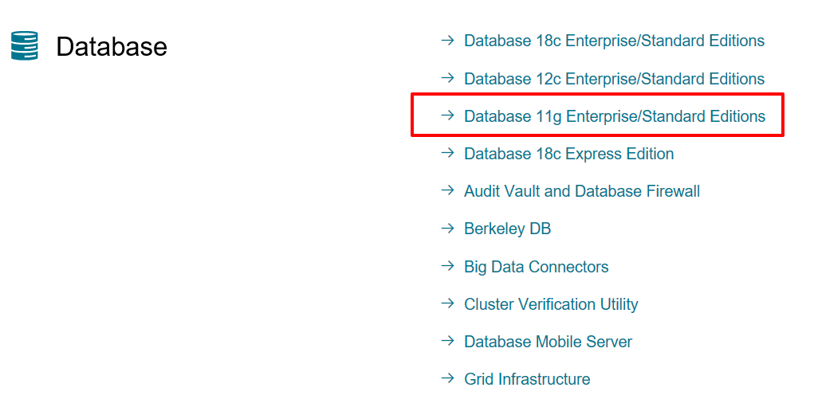
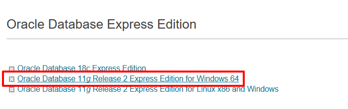
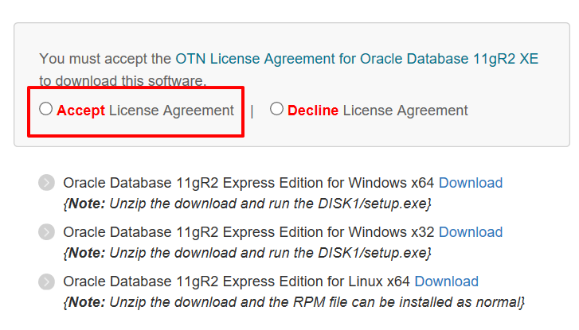

# SQL DEVELOPER 단축키

- Ctrl + space = 자동완성
- Ctrl + F7 = 자동정렬
- Ctrl + Enter = 명령문 실행
- F5  = 명령문 전체 실행

# 기본설치

1. 오라클시스템 

	Oracle Database Express Edition 11g : 서버  
[https://www.oracle.com/downloads/index.html](https://www.oracle.com/downloads/index.html)

  Database 11g를 클릭한다.

    

Oracle Database 11g를 클릭한다.

Accept를 클릭한 후 운영체제에 맞는 버전을 다운로드한다.  
다운로드 시 Oracle 아이디가 필요하니 아이디가 없는 경우  회원가입 후 다운을 한다.

  

2. 오라클 DB 관리 툴
	sql-developer  
[https://www.oracle.com/technetwork/developer-tools/sql-developer/downloads/index.html](https://www.oracle.com/technetwork/developer-tools/sql-developer/downloads/index.html)

    
  

# 데이터베이스란 ?

데이터베이스 - 데이터를 저장하기 위한 집합

